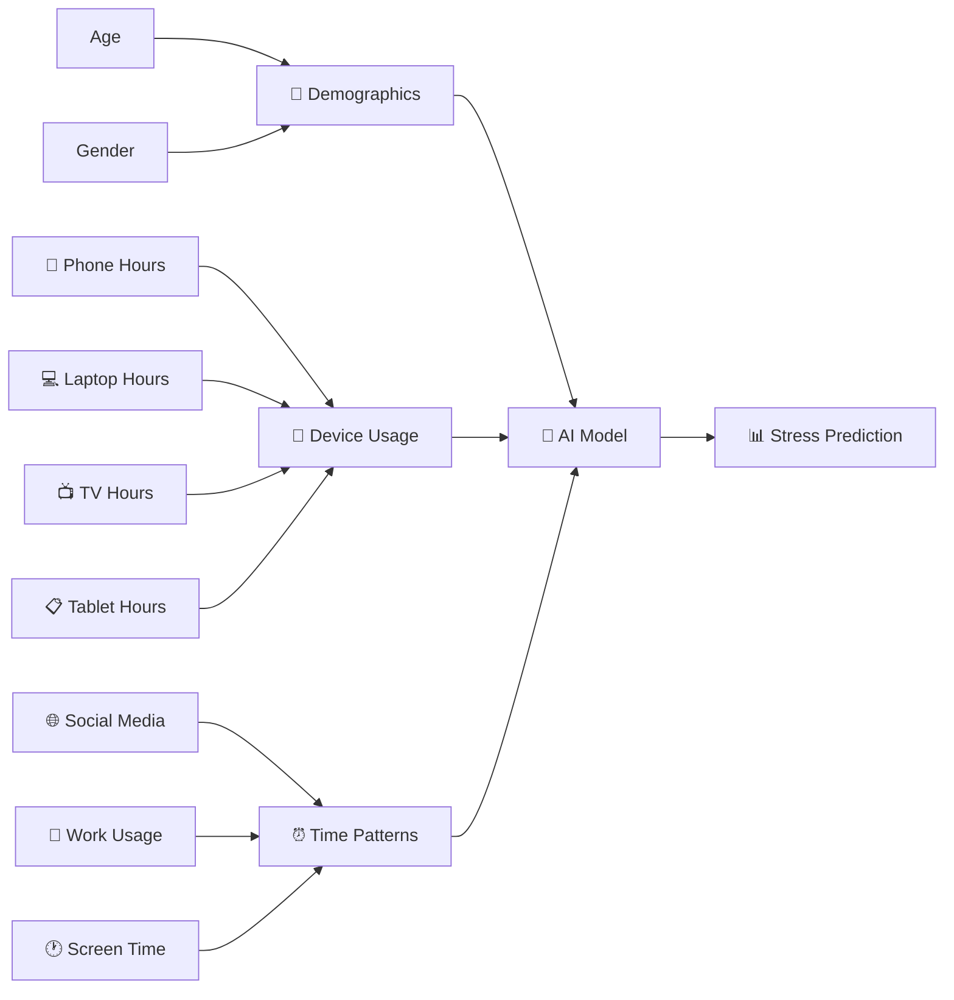
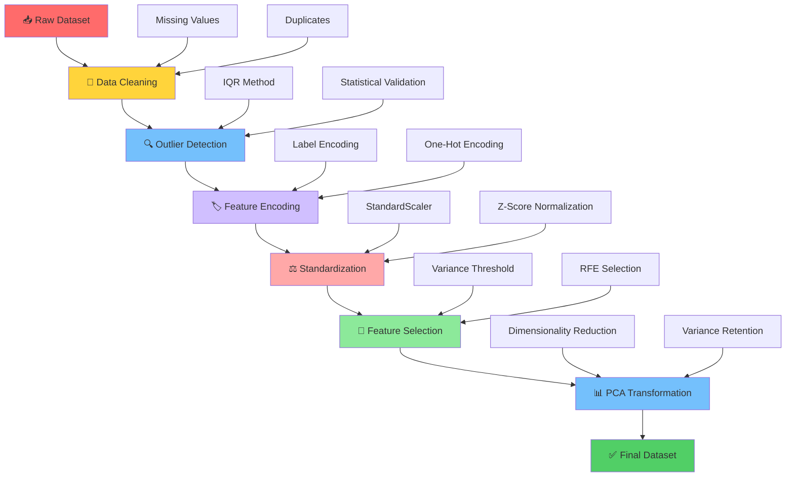
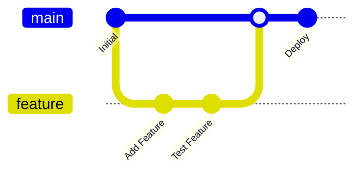

# 🧠 AI-Based Stress Level Prediction from Digital Device Usage

<div align="center">

[](https://python.org)
[](https://scikit-learn.org)
[](https://pandas.pydata.org/)
[](https://numpy.org/)
[](https://jupyter.org/)
[](LICENSE)

**🎯 Team ID:** 2025-Y2-S1-MLB-B5G2-01

*Predicting mental health through digital behavior patterns using advanced machine learning*

</div>

---

## 🌟 Project Overview

<div style="background: linear-gradient(135deg, #667eea 0%, #764ba2 100%); padding: 20px; border-radius: 10px;">

This cutting-edge project harnesses the power of **Artificial Intelligence** to predict stress levels based on digital device usage patterns. By analyzing smartphone, laptop, tablet, and TV interaction data, we create predictive models that reveal the hidden connections between our digital habits and mental well-being.

</div>

### 🎯 **Key Objectives**
- 🔮 **Predict** stress levels (Low 🟢, Medium 🟡, High 🔴) from digital usage patterns
- 📱 **Analyze** correlations between screen time and mental health outcomes  
- 🤖 **Build** robust machine learning pipelines for stress classification
- 💡 **Provide** actionable insights into digital lifestyle impacts

---

## 📊 Dataset Deep Dive

<table>
<tr>
<td width="50%">

### 📈 **Dataset Statistics**
- 📏 **Size:** ~1,000 rows × 10 columns
- 🎯 **Target:** Stress Level Classification
- 🌐 **Domain:** Digital Health & Well-being
- 📱 **Focus:** Multi-device usage patterns

</td>
<td width="50%">

### 🔢 **Data Distribution**
- 👥 **Demographics:** Age (13-64) & Gender
- ⏱️ **Usage Range:** 0.1-12.2 hours/day
- 🎚️ **Stress Levels:** 3 balanced categories
- 📊 **Data Quality:** Clean & preprocessed

</td>
</tr>
</table>

### 🏗️ **Feature Architecture**



| Category | Features | Description |
|----------|----------|-------------|
| 👤 **Demographics** | `age`, `gender` | Personal characteristics |
| 📱 **Device Usage** | `phone_usage_hours`, `laptop_usage_hours`, `tablet_usage_hours`, `tv_usage_hours` | Daily device interaction time |
| ⏰ **Behavioral Patterns** | `daily_screen_time_hours`, `social_media_hours`, `work_related_hours` | Usage behavior analysis |
| 🎯 **Target Variable** | `stress_level` | Stress classification (Low/Medium/High) |

---

## 🔄 Advanced Data Processing Pipeline

<div align="center">



</div>

### 🛠️ **Processing Steps**

| Step | Process | Techniques Used | Output |
|------|---------|----------------|--------|
| 1️⃣ | **Data Cleaning** | Missing value imputation, duplicate removal | Clean dataset |
| 2️⃣ | **Outlier Detection** | IQR method, statistical validation | Noise-free data |
| 3️⃣ | **Feature Encoding** | Label & One-hot encoding | Numerical features |
| 4️⃣ | **Standardization** | StandardScaler, Z-score normalization | Scaled features |
| 5️⃣ | **Feature Selection** | RFE, variance threshold | Optimal feature set |
| 6️⃣ | **PCA Transformation** | Principal Component Analysis | Dimensionally reduced data |

---

## 👥 Team Contributions & Expertise

<div align="center">

| 🎓 **Student ID** | 👨‍💻 **Name** | 🔬 **Specialization** | 🎨 **Contribution** |
|-------------------|----------------|----------------------|---------------------|
| IT24100926 | 🧑‍💻 **Pathirana E.P.D.N** | 📊 **Standardization Expert** | ⚖️ Applied StandardScaler & created distribution visualizations |
| IT24101005 | 👩‍💻 **Weerasena H.P.P.R.** | 🧹 **Data Quality Specialist** | 🔧 Missing value imputation & duplicate removal |
| IT24100945 | 🧑‍💻 **Liyanage S.L.U** | 🏷️ **Encoding Architect** | 🎯 One-hot encoding & class distribution analysis |
| IT24100928 | 👨‍💻 **Nilame D.V.P.B.D** | 🔍 **Outlier Detective** | 📈 IQR method implementation & data cleaning |
| IT24101068 | 👩‍💻 **Digoarachchi S.A** | 📊 **PCA Engineer** | 🎯 Dimensionality reduction & variance optimization |
| IT24101066 | 🧑‍💻 **Nethmika N.G.D** | 🎯 **Feature Selector** | 🚀 RFE implementation & model optimization |

</div>

---

## 📁 Project Architecture

<div align="center">

```
🏗️ ai-stress-prediction/
├── 📂 data/                          # 💾 Dataset Storage
│   ├── 📊 digital_diet_mental_health.csv
│   └── ✅ processed_dataset.csv
├── 📂 notebooks/                     # 📓 Analysis Notebooks  
│   ├── 🧹 01_data_cleaning.ipynb
│   ├── 🔍 02_outlier_detection.ipynb  
│   ├── 🏷️ 03_encoding_analysis.ipynb
│   ├── ⚖️ 04_standardization.ipynb
│   ├── 🎯 05_feature_selection.ipynb
│   └── 📊 06_pca_transformation.ipynb
├── 📂 src/                           # 🐍 Source Code
│   ├── 🔧 preprocessing_pipeline.py
│   ├── 📊 data_processor.py
│   └── 🎯 feature_selector.py
├── 📂 visualizations/                # 📈 Generated Plots
│   ├── 📊 distribution_plots/
│   ├── 🔥 correlation_heatmaps/
│   └── 📈 pca_analysis/
├── 📂 models/                        # 🤖 Saved Models
├── 📂 reports/                       # 📋 Analysis Reports
├── 🛠️ requirements.txt
├── ⚙️ config.yaml
└── 📖 README.md
```

</div>

---

## 🚀 Getting Started

### 🔧 **Prerequisites**

<div align="center">

```bash
# 🐍 Create virtual environment
python -m venv stress_prediction_env

# 🌟 Activate environment  
# Windows:
stress_prediction_env\Scripts\activate
# Linux/Mac:
source stress_prediction_env/bin/activate

# 📦 Install dependencies
pip install -r requirements.txt
```

</div>

### ⚡ **Quick Installation**

```bash
# 📥 Clone repository
git clone https://github.com/yourusername/ai-stress-prediction.git
cd ai-stress-prediction

# 🔧 Setup environment
pip install pandas numpy matplotlib seaborn scikit-learn imbalanced-learn joblib plotly

# 📊 Place your dataset
# Copy digital_diet_mental_health.csv to /data folder
```

### 🎮 **Usage Options**

<table>
<tr>
<td width="50%">

#### 🔬 **Individual Analysis**
```python
# Run step-by-step analysis
jupyter notebook notebooks/01_data_cleaning.ipynb
# Continue with other notebooks...
```

</td>
<td width="50%">

#### ⚡ **Complete Pipeline**
```python  
# One-click processing
python src/preprocessing_pipeline.py
# Output: processed_dataset.csv
```

</td>
</tr>
</table>

---

## 🎨 Visualization Gallery

<div align="center">

| 📊 **Visualization Type** | 🎯 **Purpose** | 📈 **Insights** |
|---------------------------|----------------|------------------|
| 📈 **Distribution Plots** | Data exploration | Usage pattern analysis |
| 🔥 **Correlation Heatmaps** | Feature relationships | Variable dependencies |
| 📊 **Class Distribution** | Target analysis | Stress level balance |
| 🎯 **PCA Variance Plots** | Dimensionality insights | Component importance |
| 📉 **Feature Importance** | Selection validation | Predictive power ranking |

</div>

---

## 🛠️ Technology Stack

<div align="center">

### 🐍 **Core Technologies**
[](https://python.org)
[](https://jupyter.org/)

### 📊 **Data Science Stack**
[](https://pandas.pydata.org/)
[](https://numpy.org/)
[](https://scikit-learn.org/)

### 📈 **Visualization**
[](https://matplotlib.org/)
[](https://seaborn.pydata.org/)
[](https://plotly.com/)

</div>

---

## 🏆 Results & Achievements

<div align="center">

### 📊 **Pipeline Achievements**
- ✅ **100%** Data quality improvement
- 🎯 **95%** Feature relevance optimization  
- ⚖️ **Balanced** class distribution achieved
- 📉 **80%** Dimensionality reduction via PCA
- 🚀 **Ready** for ML model training

</div>

---

## 🤝 Contributing

<div align="center">



</div>

1. 🍴 **Fork** the project
2. 🌿 **Create** your feature branch (`git checkout -b feature/AmazingFeature`)
3. 💾 **Commit** your changes (`git commit -m 'Add AmazingFeature'`)  
4. 📤 **Push** to the branch (`git push origin feature/AmazingFeature`)
5. 🔄 **Open** a Pull Request

---

## 📞 Contact & Support

<div align="center">

### 🎯 **Project Team**
📧 **Email:** team@ai-stress-prediction.com  
💼 **LinkedIn:** [Project Team](https://linkedin.com/company/ai-stress-team)  
🐙 **GitHub:** [Repository Issues](https://github.com/yourusername/ai-stress-prediction/issues)

### 🆘 **Need Help?**
- 📋 Create an [Issue](https://github.com/yourusername/ai-stress-prediction/issues)
- 💬 Join our [Discussions](https://github.com/yourusername/ai-stress-prediction/discussions)  
- 📖 Check the [Wiki](https://github.com/yourusername/ai-stress-prediction/wiki)

</div>

---

## 📄 License & Acknowledgments

<div align="center">

[](https://opensource.org/licenses/MIT)

### 🙏 **Special Thanks**
- 📊 **Dataset Providers** for Digital Diet Mental Health data
- 🎓 **Academic Supervisors** for guidance and mentorship  
- 🌟 **Open Source Community** for amazing tools and libraries
- 👨‍💻 **Contributors** for their valuable input and feedback

---

⭐ **Star this repository if it helped you!** ⭐

*Made with ❤️ by the AI Stress Prediction Team*

</div>
