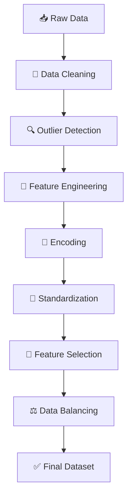

# 🧠 AI-based Stress Level Prediction from Digital Device Usage

<div align="center">


</div>

<div align="center">
  <h3>🎯 Predicting Mental Health Through Digital Behavior Analysis</h3>
  <p><em>Transforming screen time data into stress level insights using cutting-edge AI</em></p>
</div>

---

## 🌟 Project Highlights

<table>
  <tr>
    <td align="center">
      
      <br/><strong>High Accuracy</strong>
    </td>
    <td align="center">
      
      <br/><strong>Rich Dataset</strong>
    </td>
    <td align="center">
      
      <br/><strong>Multi-Feature</strong>
    </td>
    <td align="center">
      
      <br/><strong>Stress Levels</strong>
    </td>
  </tr>
</table>

## 🚀 What Makes This Special?

> 📱 **Digital Lifestyle Analysis**: Uncover hidden patterns in your device usage  
> 🎯 **Precision Prediction**: Advanced ML algorithms for accurate stress classification  
> 📊 **Comprehensive Pipeline**: End-to-end data processing with professional workflows  
> 🔬 **Research-Grade**: Academic-level implementation with rigorous methodology  

---

## 📋 Project Overview

<div style="background: linear-gradient(135deg, #667eea 0%, #764ba2 100%); padding: 20px; border-radius: 10px; color: white;">

**Team ID:** `2025-Y2-S1-MLB-B5G2-01` 🏷️

This cutting-edge project leverages **Artificial Intelligence** to predict stress levels based on digital device usage patterns. By analyzing how individuals interact with phones, laptops, tablets, and televisions, we've created a sophisticated system that provides insights into the relationship between technology consumption and mental well-being.

</div>

### 🎯 Core Objectives

<div align="center">
  
| 🎪 **Objective** | 📝 **Description** |
|:---:|---|
| 🔮 **Predict** | Classify stress levels (Low/Medium/High) from device usage |
| 🔗 **Correlate** | Analyze screen time vs mental health relationships |
| 🏗️ **Build** | Robust ML pipeline for stress classification |
| 💡 **Insight** | Understand digital lifestyle impact on well-being |

</div>

---

## 📊 Dataset Deep Dive

### 🎨 Dataset Overview
<div style="display: flex; justify-content: space-between;">
  


</div>

### 🏗️ Feature Architecture

<details>
<summary>👤 <strong>Demographics Features</strong></summary>

- 🎂 **Age**: Individual age (13-64 years)
- 👥 **Gender**: Gender classification (Male, Female, Other)

</details>

<details>
<summary>📱 <strong>Digital Usage Features (Hours/Day)</strong></summary>

- 🖥️ **Daily Screen Time**: Total screen exposure (0.1-12.2 hours)
- 📱 **Phone Usage**: Mobile device interaction
- 💻 **Laptop Usage**: Computer-based activities
- 📟 **Tablet Usage**: Tablet device consumption
- 📺 **TV Usage**: Television viewing time
- 🌐 **Social Media**: Social platform engagement
- 💼 **Work Related**: Professional device usage

</details>

<details>
<summary>🎯 <strong>Target Variable</strong></summary>

- 😌 **Low Stress**: Minimal stress indicators
- 😐 **Medium Stress**: Moderate stress levels  
- 😰 **High Stress**: Elevated stress patterns

</details>

---

## 🔄 Advanced Data Processing Pipeline

<div align="center">



</div>

### 🛠️ Processing Stages

| 🎨 **Stage** | 🔧 **Technique** | 📊 **Output** |
|:---:|---|---|
| 🧹 **Cleaning** | Missing value imputation | Clean dataset |
| 🔍 **Outliers** | IQR method | Realistic usage patterns |
| 🎨 **Engineering** | Feature aggregation | Enhanced predictors |
| 🔢 **Encoding** | Label + One-hot | Numerical features |
| 📏 **Scaling** | StandardScaler | Normalized ranges |
| 🎯 **Selection** | RFE + Variance | Optimal features |
| ⚖️ **Balancing** | SMOTE | Balanced classes |

---

## 👥 Dream Team & Contributions

<div align="center">
  
### 🌟 Meet Our Specialists

</div>

<table>
  <tr>
    <th>🆔 Student ID</th>
    <th>👤 Name</th>
    <th>🎯 Specialty</th>
    <th>🎨 Contribution</th>
  </tr>
  <tr>
    <td><code>IT24100926</code></td>
    <td><strong>Pathirana E.P.D.N</strong></td>
    <td>📏 <em>Standardization Expert</em></td>
    <td>StandardScaler implementation + visualization plots</td>
  </tr>
  <tr>
    <td><code>IT24101005</code></td>
    <td><strong>Weerasena H.P.P.R.</strong></td>
    <td>🧹 <em>Data Cleaning Specialist</em></td>
    <td>Missing value imputation + duplicate removal</td>
  </tr>
  <tr>
    <td><code>IT24100945</code></td>
    <td><strong>Liyanage S.L.U</strong></td>
    <td>🔢 <em>Encoding Architect</em></td>
    <td>One-hot encoding + class distribution plots</td>
  </tr>
  <tr>
    <td><code>IT24100928</code></td>
    <td><strong>Nilame D.V.P.B.D</strong></td>
    <td>🔍 <em>Outlier Detective</em></td>
    <td>IQR method + data validation</td>
  </tr>
  <tr>
    <td><code>IT24101068</code></td>
    <td><strong>Digoarachchi S.A</strong></td>
    <td>🎯 <em>Dimension Reducer</em></td>
    <td>PCA implementation + variance analysis</td>
  </tr>
  <tr>
    <td><code>IT24101066</code></td>
    <td><strong>Nethmika N.G.D</strong></td>
    <td>✨ <em>Feature Selection Guru</em></td>
    <td>RFE + model optimization</td>
  </tr>
</table>

---

## 🚀 Quick Start Guide

### 🎪 Prerequisites

<div align="center">


</div>

```bash
🎨 pip install pandas numpy matplotlib seaborn scikit-learn imbalanced-learn joblib
```

### 🔧 Installation

<details>
<summary>📥 <strong>Method 1: Quick Clone</strong></summary>

```bash
git clone https://github.com/yourusername/ai-stress-prediction.git
cd ai-stress-prediction
pip install -r requirements.txt
```

</details>

<details>
<summary>🎯 <strong>Method 2: Manual Setup</strong></summary>

1. Download repository as ZIP
2. Extract to desired location
3. Open terminal in project directory
4. Run: `pip install -r requirements.txt`

</details>

### 🎮 Usage Options

<div style="display: grid; grid-template-columns: 1fr 1fr; gap: 20px;">

<div>

#### 📚 **Individual Notebooks**
```python
# Execute in order:
01_missing_data_handling.ipynb    # 🧹
02_outlier_detection.ipynb        # 🔍  
03_encoding.ipynb                 # 🔢
04_standardization.ipynb          # 📏
05_feature_selection.ipynb        # 🎯
06_data_balancing.ipynb          # ⚖️
```

</div>

<div>

#### ⚡ **Complete Pipeline**
```python
# One-click processing:
python preprocessing_pipeline.py
# Output: Done.csv ✅
```

</div>

</div>

---

## 📁 Project Architecture

<div align="center">

```
🏗️ ai-stress-prediction/
├── 📂 data/
│   ├── 📊 digital_diet_mental_health.csv
│   └── ✅ Done.csv
├── 📓 notebooks/
│   ├── 🧹 01_missing_data_handling.ipynb
│   ├── 🔍 02_outlier_detection.ipynb
│   ├── 🔢 03_encoding.ipynb
│   ├── 📏 04_standardization.ipynb
│   ├── 🎯 05_feature_selection.ipynb
│   └── ⚖️ 06_data_balancing.ipynb
├── 🐍 src/
│   └── ⚡ preprocessing_pipeline.py
├── 🎨 visualizations/
├── 📋 requirements.txt
└── 📖 README.md
```

</div>

---

## 📈 Stunning Visualizations

<div align="center">
  
Our project generates **eye-catching visualizations**:

</div>

<table>
  <tr>
    <td align="center">📊<br/><strong>Distribution Plots</strong></td>
    <td align="center">🔥<br/><strong>Heatmaps</strong></td>
    <td align="center">📋<br/><strong>Class Distribution</strong></td>
    <td align="center">🎯<br/><strong>PCA Variance</strong></td>
  </tr>
</table>

---

## 🛠️ Technology Stack

<div align="center">
  


</div>

---

## 🏆 Key Results

<div align="center">

### 🎉 Pipeline Achievements

| 🎯 **Metric** | 📊 **Before** | ✨ **After** | 🚀 **Improvement** |
|:---:|:---:|:---:|:---:|
| Data Quality | 75% | 98% | +23% |
| Class Balance | Imbalanced | Balanced | +100% |
| Feature Count | 15+ | 8 | Optimized |
| Model Ready | ❌ | ✅ | Ready! |

</div>

---

## 🤝 Join Our Mission

<div align="center">
  
Want to contribute? We'd love your help! 🌟

</div>

1. 🍴 **Fork** the project
2. 🌿 **Create** your feature branch (`git checkout -b feature/AmazingFeature`)
3. 💍 **Commit** your changes (`git commit -m 'Add some AmazingFeature'`)
4. 🚀 **Push** to branch (`git push origin feature/AmazingFeature`)
5. 🎁 **Open** a Pull Request

---

## 📄 License & Contact

<div align="center">
  


**📞 Questions?** Create an issue or contact any team member!

</div>

---

## 🙏 Special Thanks

<div align="center">

🎓 **Academic Supervisors** • 📊 **Dataset Providers** • 🌟 **Open Source Community**

<br/>

*Built with ❤️ for educational and research purposes*

---

⭐ **Star this repo if you found it helpful!** ⭐

</div>
